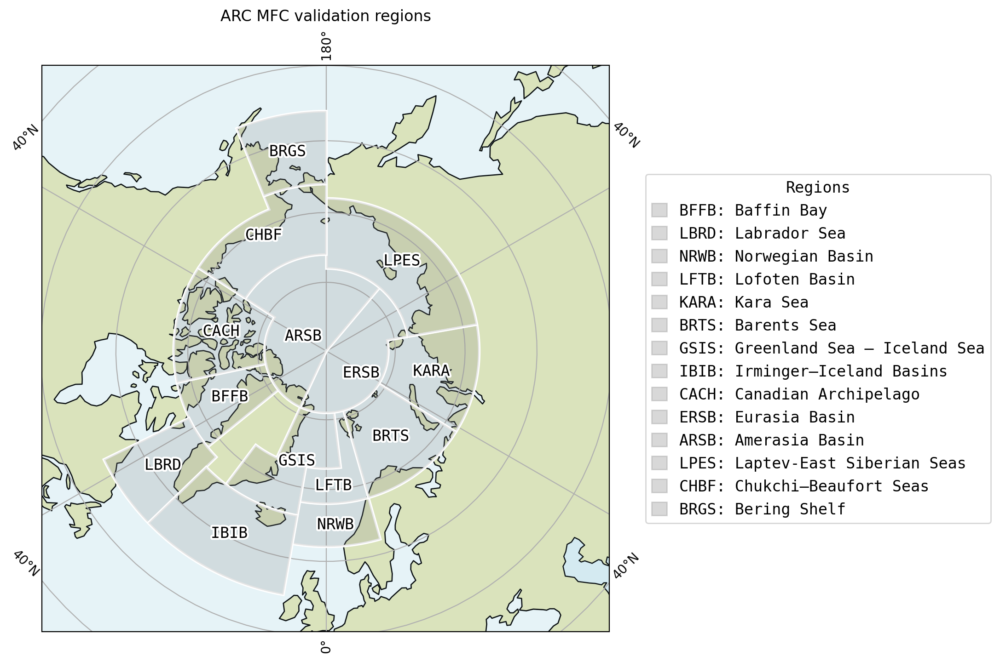

# BGC VALIDATION SCRIPTS

The purpose of this folder is to provide the set of validation scripts in one place, and be a guide for a generic model evaluation.
The codes evaluate the model output against:
1) in situ data
2) satellite data
3) BGC-Argo profiles

Before the scripts below, it is important to add the bgc.validation folder to your python path, e.g.:
```
export PYTHONPATH="$HOME/NERSC-HYCOM-CICE/bin/bgc.validation:$PYTHONPATH"
```

## Regional masks

The validation scripts aim to unify the process. As such, a common region definitions is essential. The commands below creates these masks as binary pickle files and stores them in the same folder. The files are already created and copied to cluster/projects (i.e. /cluster/projects/nn9481k/BGC.Validataion/). There is no need to repeat this process. The command below is here for documentation as an example:
```
python make_OM_regional_masks.py TP5a0.06 /cluster/work/users/cagyum/TP5a0.06/topo/regional.grid
```

## In situ data preprocess

The unified in situ data from various source (e.g. Copernicus, GLODAP) are stored as text files in "/cluster/projects/nn9481k/BGCDATA/prepobs_bgc/". The command below reads the text files, and creates python dictionaries that has information such as years, depth, regions. These dictionaries are saved as a binary file in the same folder. The file is already created and copied to NIRD (i.e. /cluster/projects/nn9481k/BGC.Validation/INSITU.OMmask.pckl). There is no need to repeat this process. The command below is here for documentation as an example:
```
python convert_txt_pckl_insitu_preobs_OMmask.py ~/NERSC-HYCOM-CICE/ 1997 2023
```

Once you have the INSITU.OMmask.pckl file, you can proceed with model to in situ data co-location process. You can run the following code in any directory. It will take mandatory and optional argumentns. You need to provide the region, experiment, start and end year, e.g. :
```
python $HOME/NERSC-HYCOM-CICE/bin/bgc.validation/model_vs_INSITU.py TP2 038 2006 2010
```
The code will by default assume your work directory is '/cluster/work/users/' (like in Betzy). If this is not the case, provide the optional argument --workdir=path-to-work. The code will retrieve your username automatically. If all goes well, it will look into the folder '/cluster/work/users/$USER/TP2a0.10/expt_03.8/data/' in this particular example.

The code will produce a series of output python pickle binary files in model data folder depending on the in situ data availability with names colocated...pckl. They will be used later.

## Satellite Mapping

The satellite mapping codes require a compiled fortran library. This library is compiled and included in this folder for betzy. If you are on a different machine, execute the following (and preferably give a different output name):

```
f2py -c -m _the_monthly_mapping_loop_ satellite_map.f90
```

The following reads monthly satellite CHL (opendap to ESA CCI), NPP (net primary production; in cluster/projects), POC (particulate organic carbon; ; in cluster/projects). Each have their own code, though they work with a similar approach. Their respective codes goes through a start year --> end year loop, and for each month, read model monthly averages, loads the required model variables, reads satellite data for that month. At that stage, it uses the precompiled fortran python library to map the satellite data (finds the matching model point, apply a satellite data averaging within a small radius) to each model point. The cloud hindered points are masked for the model data. The output is a netcdf file that contains both model data (cloud masked) and satellite data mapped to model domain.

```
python $HOME/NERSC-HYCOM-CICE/bin/bgc.validation/satellite_mapping_monthly.py TP2 038 2006 2010
python $HOME/NERSC-HYCOM-CICE/bin/bgc.validation/satellite_mapping_monthly_NPP.py TP2 038 2006 2010
python $HOME/NERSC-HYCOM-CICE/bin/bgc.validation/satellite_mapping_monthly_POC.py TP2 038 2006 2010
``` 

## Custom Designing Regional masks

You can use Jupyter notebook `def_validation_regions.ipynb` for designing your own regional masks. Following is the region definition created by the notebook which is compatible with regions defined by `make_OM_regional_masks.py`:



For further detail, see the notebook. The latest version of the notebook can be found in NERSC git repository:

[ARCMFC_BGC_validation_regions](https://github.com/nansencenter/ARCMFC_BGC_validation_regions)
